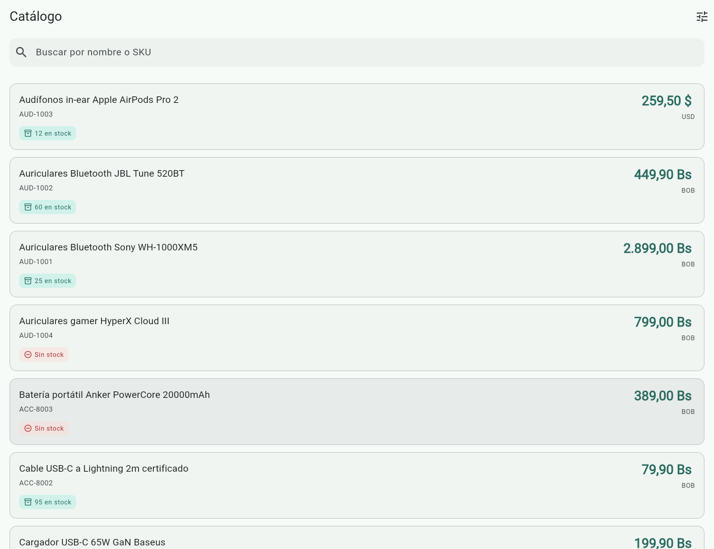
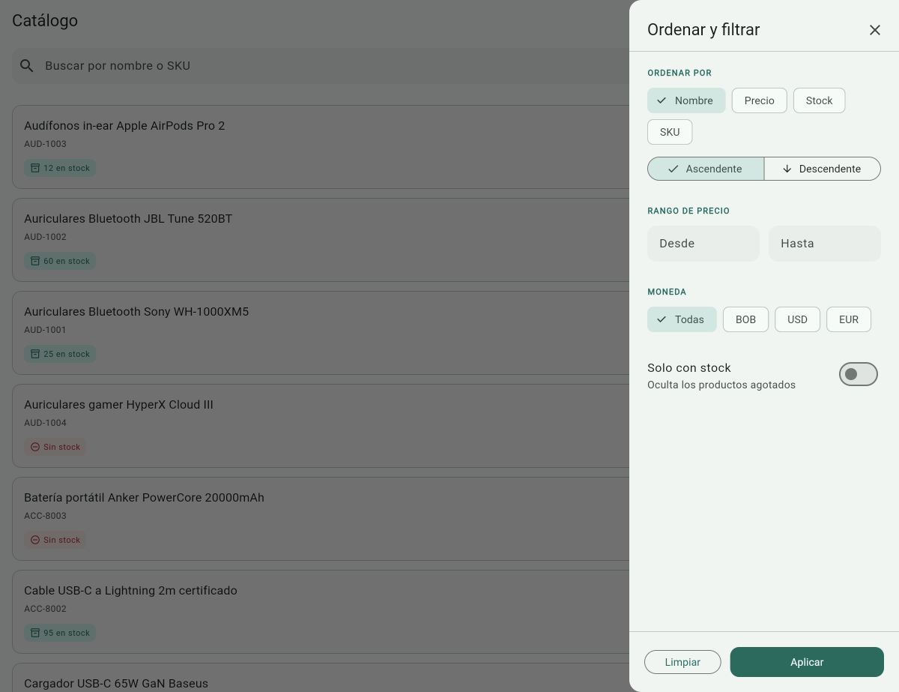
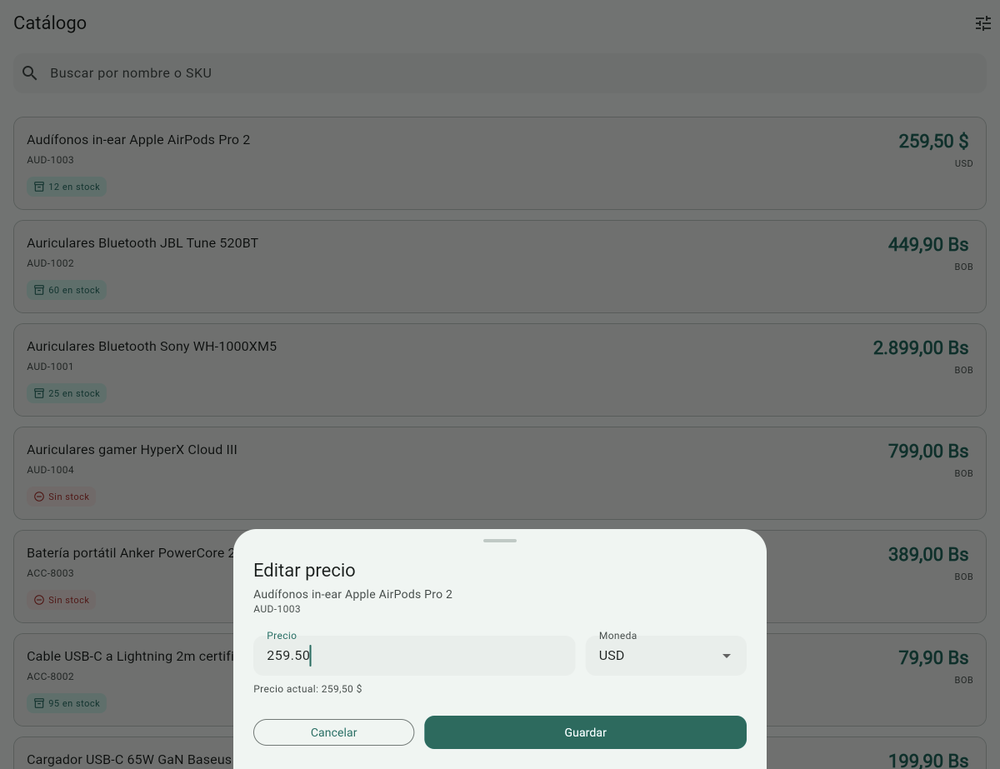
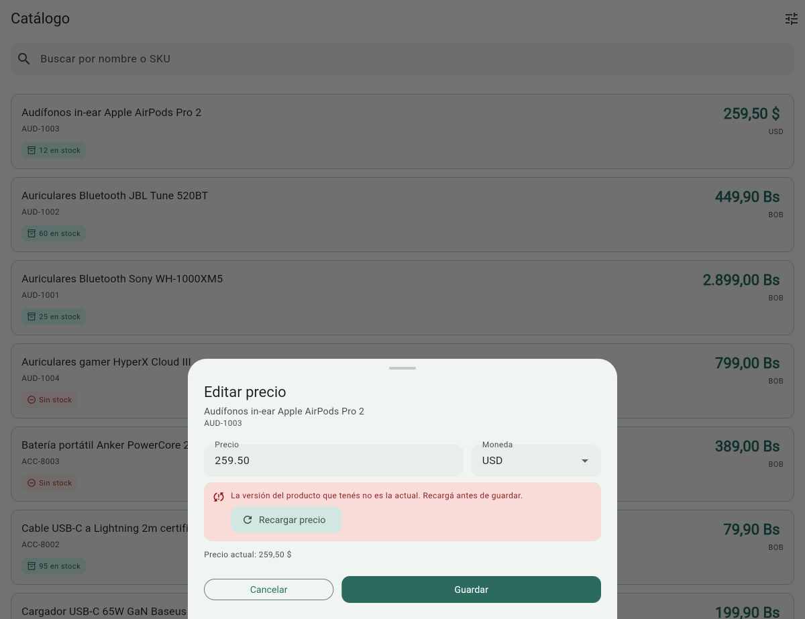
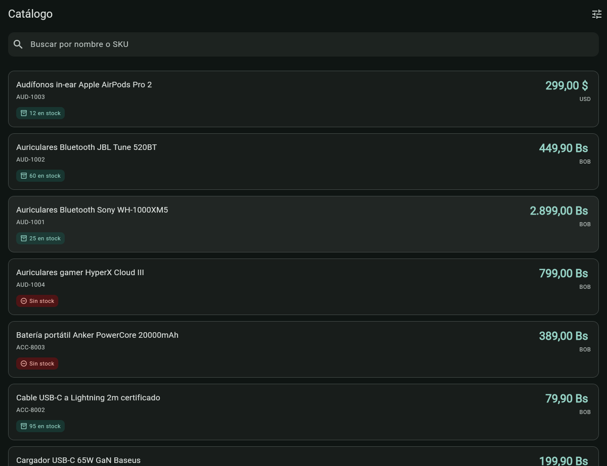

# Buscador de Productos — Flutter + .NET

Prueba técnica: catálogo de productos con búsqueda, filtros, orden, paginación y
actualización de precio con control de concurrencia optimista.

**Estado:** backend y app Flutter completos y funcionando. Tests pendientes.

---

## La app

<table>
  <tr>
    <td width="50%"></td>
    <td width="50%"></td>
  </tr>
  <tr>
    <td><b>Listado</b> — nombre, SKU, precio con su moneda y estado de stock. Búsqueda por nombre o SKU que ignora acentos, y scroll infinito.</td>
    <td><b>Orden y filtros</b> — cuatro campos de orden con dirección, rango de precio, moneda y "solo con stock". El ícono lleva un contador de filtros activos.</td>
  </tr>
  <tr>
    <td></td>
    <td></td>
  </tr>
  <tr>
    <td><b>Editar precio</b> — solo ese campo y la moneda. Validación en el cliente y en el servidor.</td>
    <td><b>Conflicto de versión</b> — otra persona editó mientras tanto. El servidor responde 412 sin escribir y el formulario ofrece recargar el precio actual.</td>
  </tr>
</table>



El modo oscuro sale del tema del sistema y no requirió tocar ningún widget:
ninguno usa un color literal, todos salen del `ColorScheme`.

---

## Cómo correr

### Requisitos

- [.NET SDK 10.0.400](https://dotnet.microsoft.com/download) o superior
- [Flutter 3.47](https://docs.flutter.dev/get-started/install) o superior
- `dotnet-ef` solo si vas a crear migraciones nuevas:
  `dotnet tool install --global dotnet-ef`

La versión del SDK está fijada en `backend/global.json` con
`rollForward: latestFeature`, así que un SDK 10.0.4xx más nuevo también sirve.

### Backend

```bash
cd backend
dotnet run --project src/Sol.Catalog.Api
```

| | |
|---|---|
| API | http://localhost:5151 |
| Documentación interactiva | http://localhost:5151/scalar/v1 |
| Estado de salud | http://localhost:5151/health |

No hace falta configurar nada más. Al arrancar en `Development` la aplicación
aplica las migraciones y siembra 38 productos; la base es un archivo SQLite
(`catalog.db`) que se crea solo y está fuera del control de versiones.

El seed es idempotente: si ya hay productos no hace nada, así que podés
reiniciar sin duplicar el catálogo ni perder los precios que hayas editado
probando. Para empezar de cero, borrá `backend/src/Sol.Catalog.Api/catalog.db`.

### Frontend

Con el backend corriendo, en otra terminal:

```bash
cd frontend
cp .env.example .env
flutter pub get
flutter run -d chrome --dart-define-from-file=.env
```

**Cada plataforma ve el `localhost` del backend de forma distinta.** Es la causa
número uno de "la app no conecta", así que la URL se configura en vez de estar
fija en el código:

| Plataforma | `API_BASE_URL` |
|---|---|
| Web (Chrome) y simulador iOS | `http://localhost:5151` |
| Emulador Android | `http://10.0.2.2:5151` |
| Dispositivo físico | `http://192.168.x.x:5151` |

El emulador de Android corre en su propia máquina virtual: su `localhost` es el
del emulador, no el de tu máquina. `10.0.2.2` es el alias que Android reserva
para el host.

El `.env` está en el `.gitignore`; `.env.example` es la plantilla. Si no existe
ninguno, la app usa `http://localhost:5151`, que sirve para web y para el
simulador de iOS.

**Desde VS Code**, el panel *Run and Debug* trae tres configuraciones ya listas:
`App (.env)` —que necesita el archivo creado— y `App — web / simulador iOS` y
`App — emulador Android`, que fijan la URL directamente y no lo necesitan. Usalas en
vez de F5 a secas: la extensión de Flutter no pasa `--dart-define-from-file` por
su cuenta, así que sin ellas la app arranca apuntando a `localhost` sin avisar
—falla en silencio, porque todo levanta bien y solo la URL está mal—.

Y como los valores son constantes de compilación, **cambiar el `.env` no se
refleja con hot reload**: hay que parar y relanzar.

**No se usa `flutter_dotenv`.** El archivo lo consume `--dart-define-from-file`,
que acepta formato `.env` además de JSON, y el compilador incrusta los valores
como constantes: no hay asset extra que empaquetar y un valor faltante se
detecta al compilar, no en la primera pantalla.

Conviene decirlo antes de que lo pregunten: **una clave embebida en una app
cliente no es un secreto**, ni con `.env` ni con `--dart-define`. Está en el
bundle de la web y en el APK. Sirve para identificar a la aplicación y aplicarle
límites de uso, no para autenticar a una persona.

### Configuración opcional del backend

| Clave | Para qué | Por defecto |
|---|---|---|
| `ConnectionStrings:Catalog` | Ruta de la base SQLite | `Data Source=catalog.db` |
| `Security:ApiKey` | Si tiene valor, la API exige la cabecera `X-Api-Key` | vacío — no exige nada |
| `Cors:AllowedOrigins` | Lista blanca de orígenes | vacía — permite cualquiera |

La clave de API nunca va en `appsettings.json`. En desarrollo:

```bash
dotnet user-secrets set Security:ApiKey <valor> --project src/Sol.Catalog.Api
```

El `UserSecretsId` ya está declarado en el `.csproj`, así que no hace falta
`dotnet user-secrets init`. Los valores se guardan fuera del repositorio, en el
perfil del usuario.

En producción, variable de entorno `Security__ApiKey` o un gestor de secretos.
Que sea opcional es deliberado: quien clone el repo debe poder levantar la API y
probarla sin configurar nada.

---

## Contrato de la API

| Método | Ruta | Códigos |
|---|---|---|
| `GET` | `/api/v1/products` — `q`, `page`, `pageSize`, `sortBy`, `sortDir`, `minPrice`, `maxPrice`, `currency`, `inStock` | 200 · 400 |
| `GET` | `/api/v1/products/search?q=` — alias del anterior | 200 · 400 |
| `GET` | `/api/v1/products/{id}` — devuelve `ETag` | 200 · 404 |
| `PATCH` | `/api/v1/products/{id}/price` — acepta `If-Match` | 200 · 400 · 404 · 409 · 412 |
| `GET` | `/health` | 200 · 503 |

```http
PATCH /api/v1/products/3/price
Content-Type: application/json
If-Match: "1"

{ "price": "259.50", "currency": "USD" }
```

Los errores usan **ProblemDetails (RFC 9457)**, con detalle por campo cuando
corresponde:

```json
{
  "title": "Los datos enviados no son válidos",
  "status": 400,
  "code": "Product.PriceMustBePositive",
  "errors": { "price": ["El precio debe ser mayor a 0."] }
}
```

El campo `code` es el identificador estable. Un cliente debería reaccionar a él
y no al texto de `detail`, que puede reescribirse o traducirse sin aviso.

`GET /products/search` es un alias literal del requisito del enunciado
—"devuelve productos filtrados por name o sku"— y delega en **el mismo
handler**, así que no hay lógica duplicada. La ruta canónica es
`GET /products?q=`: un filtro es un parámetro sobre la colección, no un recurso
aparte. La app usa la canónica.

### Ver el control de concurrencia funcionando

Es la parte menos visible y la más interesante. Con la app abierta en dos
pestañas del navegador:

1. En ambas, abrí el editor de precio del **mismo** producto.
2. Guardá en la primera. Se actualiza normalmente.
3. Guardá en la segunda: su `If-Match` ya está vencido → **412**, y el
   formulario muestra "Otra persona modificó este producto" con un botón
   **Recargar precio**.
4. Tocá *Recargar precio*: trae la versión actual y ahora sí guarda.

En ningún momento se pisa el cambio de la otra pestaña en silencio, que es el
objetivo de todo el mecanismo.

---

## Decisiones técnicas

### 1. El precio viaja como cadena, no como número

Dart no tiene un tipo decimal nativo y `jsonDecode` convierte cualquier número
JSON a `double`, que es binario y no representa `0.1` de forma exacta. Aunque el
backend guarde `decimal`, si el precio viajara como número la precisión se
perdería **del lado del cliente, al parsear**. Como cadena, Flutter lo lee con
el paquete `decimal` y la exactitud se mantiene de punta a punta.

La alternativa habitual —enteros en la unidad menor, como hace Stripe— se
descartó porque obliga a conocer cuántos decimales tiene cada moneda: el yen
tiene cero y el dinar bahreiní tiene tres.

### 2. Arquitectura

Cuatro capas con la dependencia apuntando siempre hacia adentro:

```
Api → Infrastructure → Application → Domain
```

`Sol.Catalog.Domain.csproj` **no tiene un solo `PackageReference`**. Es la
verificación de un vistazo de que la arquitectura es real: si el dominio
importara EF Core o ASP.NET, la regla de dependencia sería un adorno.

`Infrastructure` apunta a `Application` y no al revés porque los puertos
(`IProductReader`, `IProductWriter`, `IUnitOfWork`) se declaran en la capa que
los consume. Esa inversión es lo que permite testear los casos de uso sin base
de datos.

### 3. Errores como `Result`, no como excepciones

"El producto no existe" y "el precio es inválido" pasan todos los días: son
resultados normales del negocio. La base caída no lo es, y esa sí viaja como
excepción hasta el handler global.

Tres beneficios concretos: la firma no miente (`Task<Result<Product>>` declara
que puede fallar, `Task<Product>` que lanza `NotFoundException` no lo declara en
ningún lado); lanzar excepciones en .NET captura el stack trace y es caro; y el
`ErrorType` del dominio se traduce a HTTP en un único lugar del borde.

### 4. Concurrencia optimista con ETag / If-Match

`GET` devuelve `ETag: "3"`; el `PATCH` lo reenvía en `If-Match`. Si la versión
ya no coincide, la escritura **ni se intenta**: 412.

Se distinguen dos situaciones que suelen confundirse:

- **412** — el `If-Match` del cliente está vencido. La base no se toca.
- **409** — alguien escribió entre nuestra lectura y nuestro guardado. Lo
  detecta EF Core porque el `UPDATE` lleva `AND Version = @original` en el
  `WHERE` y afecta cero filas.

No se reintenta a propósito: reintentar pisaría el cambio ajeno, que es justo lo
que la concurrencia optimista viene a evitar.

Del lado de la app el ciclo se cierra: ante un conflicto el formulario ofrece
**Recargar precio**, que trae la versión actual con `GET /products/{id}`,
actualiza el campo y el ETag, y deja reintentar con datos buenos. Un mensaje que
dice "recargá" sin dar con qué es un callejón sin salida.

`Version` es un `int` que incrementa el dominio, no el `byte[] RowVersion`
habitual, porque SQLite no tiene un tipo rowversion que la base actualice sola.
Un entero funciona en cualquier motor, es determinista —y por lo tanto
testeable— y produce un `ETag` legible.

Poner el mismo precio **no cuenta como cambio**: no incrementa la versión ni
toca la fecha. Eso hace que el `PATCH` sea realmente idempotente y evita que
reenviar la petición tras un timeout invalide el `ETag` del cliente y devuelva
un 412 que no corresponde.

### 5. Sin MediatR, y por qué

MediatR pasó a licencia comercial para uso no open source desde la v13. Lo único
que se usaba de él eran cuatro interfaces y el pipeline de behaviors. Las
interfaces son veinte líneas (`Abstractions/Messaging/`) y el pipeline se
reimplementó como decorador (`Behaviors/ValidationDecorator.cs`), que además es
el principio abierto/cerrado en acción: si mañana hace falta logging, caché o
métricas, es otro decorador y ningún handler se toca.

El registro en DI ata la interfaz a una factoría que envuelve al handler, así
que quien pida `IQueryHandler<TQuery, TResult>` recibe **siempre** la versión
decorada. No hay forma de saltearse la validación por olvido.

### 6. `PATCH` y no `PUT`

El alcance del cambio está limitado por la URL (`/price`) y por el cuerpo, que
solo tiene precio y moneda. Al no existir una propiedad `Stock` ni `Name` en el
DTO de entrada, es imposible que una petición las modifique aunque las mande en
el JSON: es la defensa contra *mass assignment*, y sale gratis por no reusar la
entidad como modelo de entrada.

Devuelve el producto actualizado en el cuerpo en vez de un 204 para que el
cliente no necesite una segunda llamada en el camino más usado de la pantalla.

### 7. La búsqueda ignora acentos y mayúsculas

El `LIKE` de SQLite solo pliega mayúsculas en el rango ASCII. Sin normalizar,
buscar `audifonos` **no** encuentra "Audífonos" —`i` e `í` son caracteres
distintos— y buscar `AUDÍFONOS` tampoco, porque `Í` nunca coincide con `í`. La
gente escribe sin tildes; si la búsqueda las exige, no sirve.

Se resuelve con una columna sombra (`SearchText`) que guarda nombre y SKU
juntos, en minúsculas y sin acentos. La mantiene el `DbContext` al guardar, no
un trigger, para que valga igual desde el seed, desde un caso de uso o desde un
test: no hay forma de escribir un producto salteándose eso.

El mapa de acentos está escrito a mano en vez de usar
`string.Normalize(FormD)` porque el proyecto declara
`InvariantGlobalization=true`, y en modo invariante `Normalize` no lanza:
simplemente no hace nada. Apagar esa opción arrastraría ICU —decenas de megas en
un contenedor— para plegar doce caracteres.

La eñe **no** se pliega: en español es una letra propia, no una `n` con adorno.
"año" y "ano" son palabras distintas.

### 8. El importe se guarda como entero

SQLite no tiene tipo decimal: EF Core mapea `decimal` a `TEXT`, y entonces las
comparaciones se hacen como texto, donde `"1000.00" < "199.90"`. Eso rompe dos
cosas que el enunciado pide: ordenar por precio y filtrar por rango. Guardado
como `INTEGER` en centavos, el `ORDER BY` y el `WHERE` son numéricos de verdad.

Limitación asumida: el factor 100 supone monedas de dos decimales. Sirve para
BOB, USD y EUR; no serviría para el yen ni el dinar bahreiní.

### 9. Calidad automatizada, no por disciplina

`Directory.Build.props` declara `TreatWarningsAsErrors`, `EnableNETAnalyzers` y
`EnforceCodeStyleInBuild`. **Cualquier advertencia rompe el build.** Un repo
"limpio salvo cuarenta warnings" no es un repo limpio.

Las versiones de paquetes están centralizadas con Central Package Management
(`Directory.Packages.props`): los `.csproj` declaran qué paquete usan pero no
qué versión, así que es imposible que dos proyectos terminen con versiones
distintas del mismo paquete y aparezca un conflicto de binding en runtime.

Las tres supresiones de analizadores del repo están acotadas al archivo o
carpeta donde hacen falta, nunca al repo entero.

---

## Estructura

```
backend/
├── global.json                     SDK fijado + runner de tests
├── Directory.Build.props           configuración de compilación de toda la solución
├── Directory.Packages.props        versiones centralizadas (CPM)
├── Sol.Catalog.slnx
└── src/
    ├── Sol.Catalog.Domain/         entidades, value objects, Result. Cero paquetes.
    ├── Sol.Catalog.Application/    casos de uso, puertos, validadores, decoradores
    ├── Sol.Catalog.Infrastructure/ EF Core, SQLite, migraciones, seed
    └── Sol.Catalog.Api/            endpoints, ProblemDetails, pipeline HTTP

frontend/
├── .env.example                    plantilla de configuración
└── lib/
    ├── core/                       config, Failure, cliente HTTP, tema, widgets
    └── features/products/
        ├── domain/                 entidades, puerto del repositorio, casos de uso
        ├── data/                   modelos, data source, implementación
        └── presentation/           Bloc de la lista, Cubit del formulario, UI
```

Las dos mitades usan la misma forma: el dominio en el centro sin dependencias
hacia afuera, y la interfaz del repositorio declarada por la capa que la
consume, no por la que la implementa.

---

## Plus implementados

El enunciado deja el plus a elección. Estos son los que entraron y por qué:

| Plus | Dónde |
|---|---|
| Paginación con scroll infinito | `hasNext` del servidor, `droppable()` en el Bloc |
| Ordenamiento por 4 campos, asc/desc | `enum` en vez de texto libre, sin riesgo en el `ORDER BY` |
| Filtros: rango de precio, moneda, solo con stock | panel lateral con orden y filtros, y contador de filtros activos |
| API key por cabecera | `IEndpointFilter` sobre el grupo, opcional por configuración |
| Logging y errores robustos | Serilog estructurado, `ProblemDetails` RFC 9457, handler global |
| UI cuidada | Material 3, modo oscuro, skeletons, estados vacíos diferenciados |

---

## Posibles mejoras

Ordenadas por lo que más aportaría primero.

**Tests.** Es el hueco más visible. El diseño está preparado —los casos de uso
se pueden testear sin base de datos porque dependen de `IProductReader`, no de
EF Core— pero no hay ni uno escrito. Faltan tests de dominio (`Money.Create`
rechaza 0, cambiar al mismo precio no incrementa la versión), de casos de uso
contra un repositorio falso, de integración con `WebApplicationFactory`, y de
Bloc con `bloc_test`.

**Caché local.** Hoy sin conexión la app no muestra nada. Guardar la última
página con `shared_preferences` o Hive permitiría abrir el catálogo y ver los
últimos datos con un aviso de "desactualizado".

**Búsqueda de texto completo.** El `LIKE '%texto%'` hace un recorrido completo
de la tabla: con 38 productos es irrelevante, con un millón no. La respuesta es
FTS5 en SQLite, no un índice sobre la columna de búsqueda —con el comodín al
principio ningún índice B-tree se puede usar—.

**Escala por moneda en el converter.** El importe se guarda como entero
multiplicado por 100, lo que supone monedas de dos decimales. Sirve para BOB,
USD y EUR; no para el yen (cero decimales) ni el dinar bahreiní (tres). La
solución general es una tabla de escala por moneda.

**Paginación por cursor.** La actual es por offset: en offsets grandes la base
descarta todas las filas anteriores, y si alguien inserta un producto entre dos
pedidos un elemento puede repetirse o saltearse. Keyset tiene costo constante,
a cambio de no poder saltar a una página arbitraria.

**Autenticación real.** La API key identifica a la aplicación, no a una
persona, y embebida en un cliente no es un secreto. Con usuarios reales
correspondería JWT con refresh tokens: el access token en memoria y el refresh
en almacenamiento seguro.

**Telemetría.** `runZonedGuarded` y `FlutterError.onError` ya capturan todo lo
que puede fallar en el cliente, pero solo va a `debugPrint`. Ese es el punto
donde se engancharía Sentry o Crashlytics; del lado del servidor, OpenTelemetry.

**Despliegue.** Dockerfile para la API, workflow de CI que corra build y
análisis en los dos proyectos, y migraciones como paso explícito del pipeline
en vez de al arrancar.
